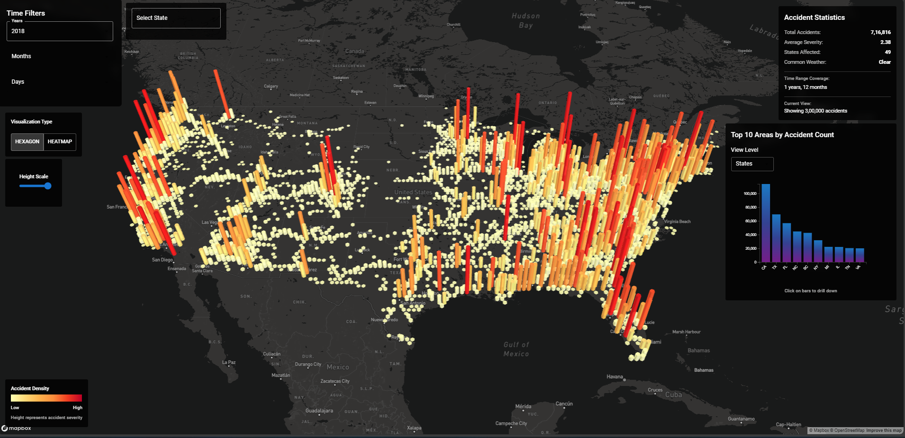
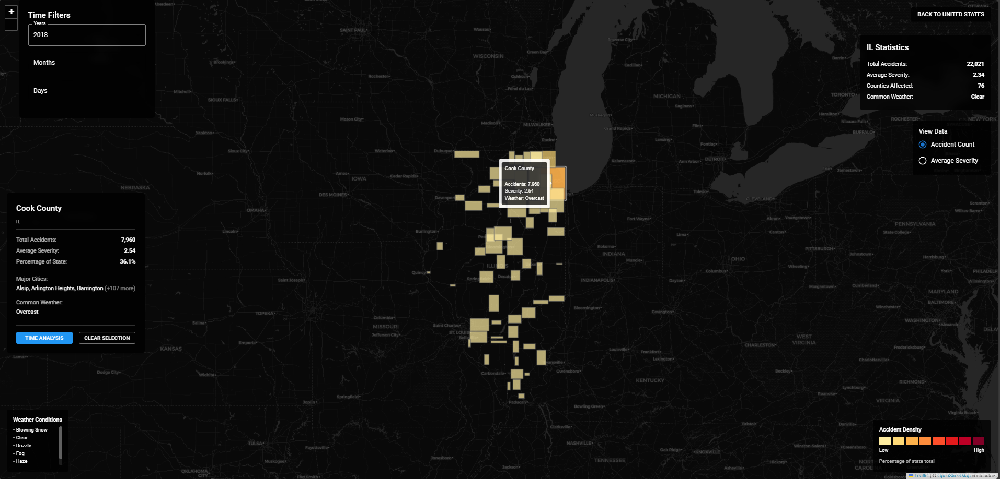
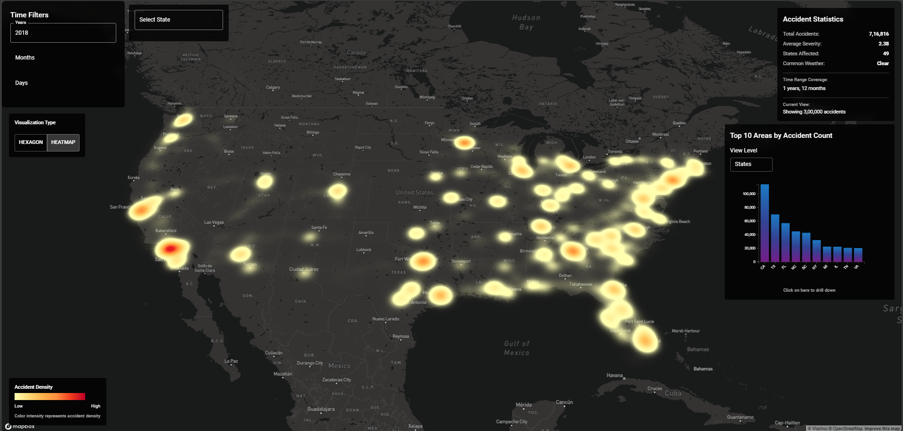
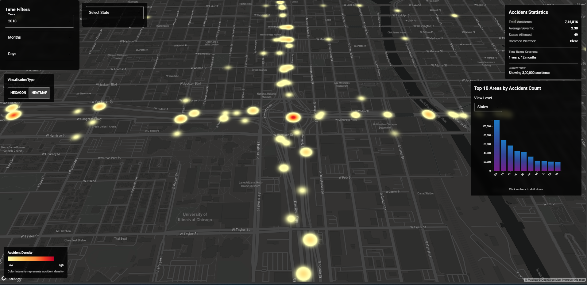
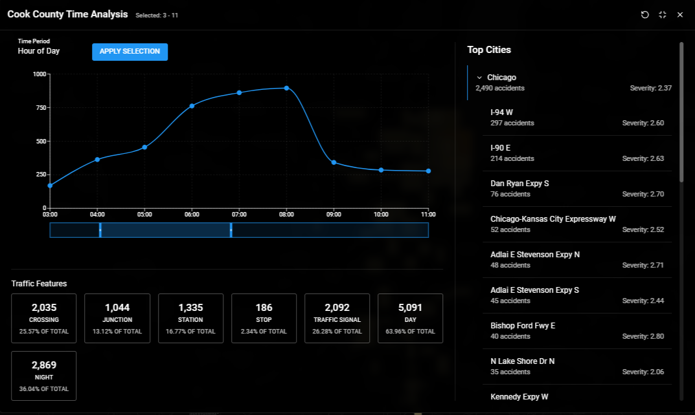

# CrashLens: Insights about US Traffic Collisions

A comprehensive web application for analyzing and visualizing traffic accident patterns across the United States. Built with React, Flask, and PostgreSQL, featuring interactive maps, detailed state/county analysis, and temporal data visualization.


*National view showing accident density and severity across the United States*


*State view showing accident density and severity across the Selected State in USA*

## Table of Contents
1. [Problem Description & Importance](#1-problem-description--importance)
2. [Data Summary](#2-data-summary)
3. [Research Challenges](#3-research-challenges)
4. [Running the Code](#4-running-the-code)
5. [Results](#5-results)
6. [Technical Implementation](#6-technical-implementation)
7. [Future Work](#7-future-work)
8. [Contributing](#8-contributing)
9. [Authors](#9-authors)
10. [References](#10-references)

## 1. Problem Description & Importance

Traffic accidents represent a critical public safety challenge with far-reaching implications:

### Why This Matters
- **Public Safety**: Millions of accidents occur annually in the US, resulting in significant loss of life and injury
- **Economic Impact**: Substantial strain on healthcare systems and insurance costs
- **Infrastructure Planning**: Challenges in road network design and traffic management
- **Resource Allocation**: Difficulty in optimizing emergency response and safety measure deployment

### Current Challenges
Traditional approaches to analyzing traffic accidents often lack:
- Granular, actionable insights
- Real-time analysis capabilities
- Comprehensive visualization tools
- Data-driven resource allocation strategies

Our interactive dashboard addresses these gaps by providing sophisticated visualization and analysis tools for stakeholders to make informed decisions about traffic safety interventions.

## 2. Data Summary

### Dataset Overview
- **Timespan**: 2016 to March 2023
- **Size**: Over 7.7 million records
- **Coverage**: Contiguous United States

### Dataset Access
The dataset can be accessed through:
1. [Kaggle US Accidents Dataset](https://www.kaggle.com/datasets/sobhanmoosavi/us-accidents/) - Original source
2. [Project Dataset Set Up (Postgres)](Database/) - Our processed version

### Project Demo
Watch our project demonstration:
- [Demo Video](https://youtu.be/DnT7srK86EM)

### Project Report
Our Project Report Can be accessed Here:
- [Report]()

### Key Attributes
- Temporal: Time, date, and severity of accidents
- Spatial: Precise location (latitude, longitude, street name, city, county, state)
- Environmental: Weather conditions
- Infrastructure: Proximity to crossings, junctions, traffic signals
- Additional Features: Railway crossings, no-exit zones, stops

### Data Processing
We calculate a Severity Index using:
```
Severity Index = ∑(Number of Accidents(i) × Severity(i)) / Total Number of Accidents
```

## 3. Research Challenges

### 1. Data Scale & Performance
- Handling and visualizing 7.7M+ records efficiently
- Optimizing query performance for real-time analysis
- Managing memory usage with large datasets
- Balancing data granularity with system performance

### 2. Visualization Complexity
- Representing multiple data dimensions simultaneously
- Creating intuitive and informative geographic visualizations
- Handling different zoom levels and data aggregation
- Maintaining performance with interactive features

### 3. Analysis Methodology
- Developing meaningful severity metrics
- Balancing accident frequency vs. severity in analysis
- Incorporating temporal patterns with spatial data
- Accounting for external factors (weather, infrastructure)

### 4. Technical Implementation
- Integrating multiple visualization libraries
- Ensuring cross-browser compatibility
- Managing state across hierarchical drill-downs
- Implementing efficient data filtering

## 4. Running the Code

### Prerequisites
- Node.js (v14 or higher)
- Python 3.8+
- PostgreSQL 12+
- Mapbox API key

### Backend Setup
1. Clone the repository:
```bash
git clone https://github.com/yash1thredddy/CrashLens-Insights-into-US-Traffic-Collisions.git
cd CrashLens-Insights-into-US-Traffic-Collisions
```

2. Create and activate virtual environment:
```bash
python -m venv venv
source venv/bin/activate  # On Windows: venv\Scripts\activate
```

3. Install Python dependencies:
```bash
pip install -r requirements.txt
```

4. Configure PostgreSQL:
```bash
# Update config.py with your database credentials
DATABASE_CONFIG = {
    "dbname": "accidents_db",
    "user": "your_username",
    "password": "your_password",
    "host": "localhost",
    "port": "5432"
}
```

### Frontend Setup
1. Install Node.js dependencies:
```bash
npm install
```

2. Configure environment variables:
```bash
# Create .env file
REACT_APP_MAPBOX_TOKEN=your_mapbox_token_here
```

### Running the Application
1. Start the Flask backend:
```bash
python run.py
```

2. Start the React frontend (in a separate terminal):
```bash
npm start
```

Access the application at `http://localhost:3000`

## 5. Results

### Key Findings

1. **Spatial Analysis**
- Identified major accident hotspots across states
- Mapped high-severity corridors and intersections
- Analyzed county-level patterns and trends


<p align="center">
  
  
</p>

2. **Temporal Patterns**
- Discovered peak accident hours (7-9 AM, 4-6 PM)
- Identified seasonal variations in accident rates
- Analyzed day-of-week patterns


3. **Infrastructure Impact**
- *Sample Results of Year 2018"
- 25.57% of accidents occur near crossings
- 13.12% occur at junctions
- 26.28% occur near traffic signals

4. **Weather Correlation**
- Clear weather dominates accident conditions
- Significant variations in severity based on weather
- Seasonal weather impact patterns identified

## 6. Technical Implementation

### Frontend Stack
- React for UI components
- Material-UI for styling
- deck.gl for map visualization
- Mapbox GL & Leaflet for mapping
- Recharts & D3.js for data visualization

### Backend Stack
- Flask for API endpoints
- PostgreSQL for data storage
- SQLAlchemy for ORM
- Flask-CORS for cross-origin support

## 7. Future Work

1. **Direct Map Visualization**
   - Interactive location viewing at granular level
   - Enhanced county-level analysis capabilities

2. **Enhanced Time Filtering**
   - Flexible date range selection
   - Custom time period analysis

3. **Performance Optimization**
   - Improved query efficiency
   - Better handling of large datasets

4. **Real-time Analysis**
   - Integration of live data streams
   - Immediate incident reporting

## 8. Contributing

1. Fork the repository
2. Create a feature branch (`git checkout -b feature/AmazingFeature`)
3. Commit your changes (`git commit -m 'Add some AmazingFeature'`)
4. Push to the branch (`git push origin feature/AmazingFeature`)
5. Open a Pull Request

## 9. Authors

- **Yashwanth Reddy Dasari Reddy**
- **Adithya Reddy Chidirala**
- **Hemanth Srinivas Reddy Chennur**

## 10. References

1. [US Accidents Dataset (2016-2023)](https://www.kaggle.com/datasets/sobhanmoosavi/us-accidents/)
2. [TA-Dash: Interactive Dashboard Paper](https://arxiv.org/abs/2008.00002)
3. [Accident Risk Prediction Paper](https://arxiv.org/abs/1909.09638)
4. [Predictive Analysis Research](https://ieeexplore.ieee.org/document/10393583)

## License

This project is licensed under the MIT License + Commons Clause - see the [LICENSE](LICENSE) file for details.